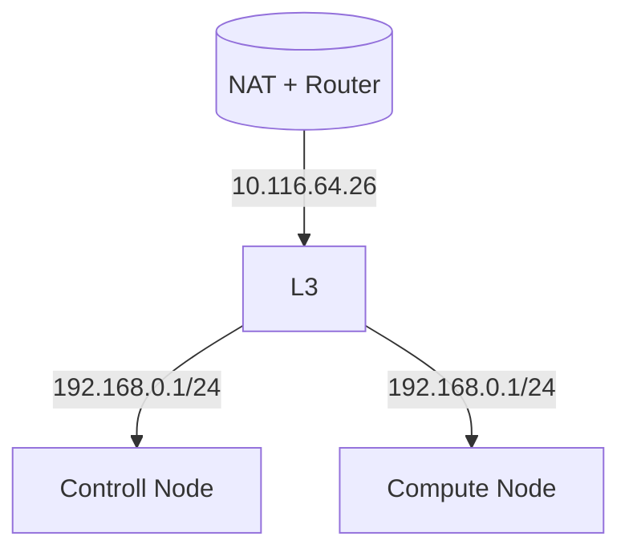
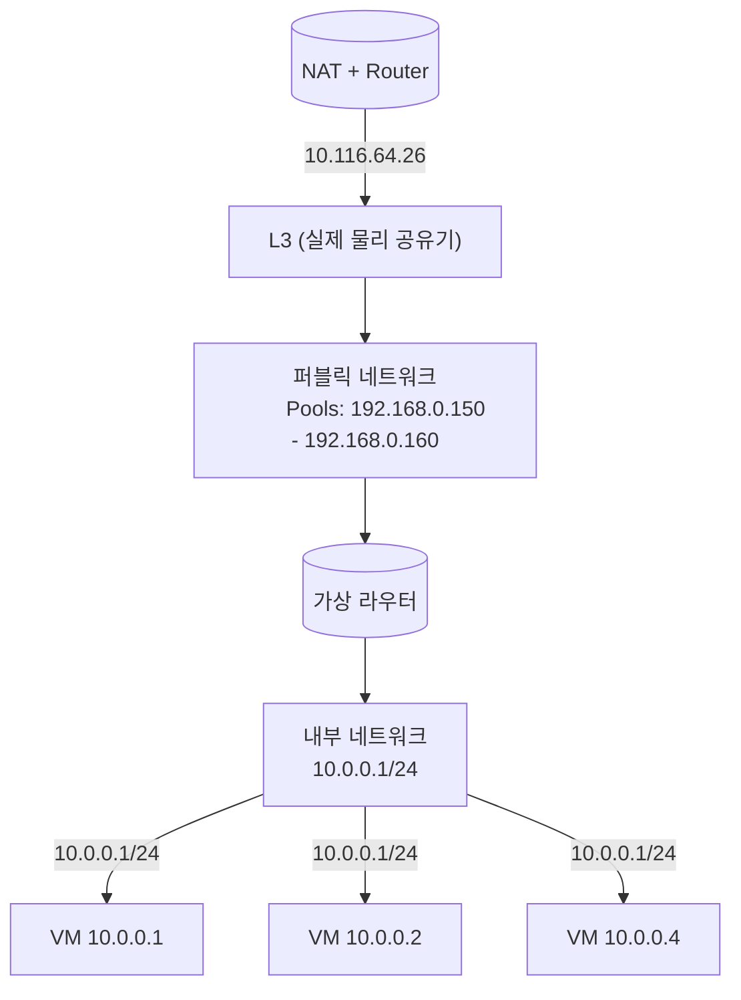

# 환경
kolla-ansible version: kolla-ansible stable/2024.2[^1] 
OS: Ubuntu 22.04.5 LTS (Jammy Jellyfish)
Node Spec: 
- Precision 7920 Rack[^2]
- 인텔 제온 실버 4114 2.2GHz,(3.0GHz Turbo, 10C)
- 인텔 제온 실버 4114 2.2GHz,(3.0GHz Turbo, 10C 2nd)
- R7920_MEM 16GB x 8pcs-980466
- M.2 512GB PCIe NVMe Class 40 SSD
- NIC x 5 (with iDrac)

[^1]: https://docs.openstack.org/kolla-ansible/2024.2/index.html
[^2]: https://www.dell.com/support/product-details/ko-kr/servicetag/0-a29MY1hKSlpmNXk0WjI0OEoyNk5wZz090/overview

___
# 아키텍쳐

### 네트워크 토폴로지


#### 노드간의 통신


#### 노드에 할당된 주소와 역할

Controller:
- eno1: 192.168.0.143 (외부 접속을 위한 NIC, 할당된 주소는 없어질 예정.)
- eno2: 172.16.0.1 (관리 네트워크)
- eno3: X
- eno4: 192.168.0.146 (ssh 접속용)

Compute:
- eno1: 192.168.0.29 (외부 접속을 위한 NIC)
- eno2: 172.16.0.2 (관리 네트워크)
- eno3: X
- eno4: 192.168.0.32 (ssh 접속용)

#### 노드별 역할
Controller: 
- Deploy Host
- Target Host

Compute:
- Target Host

> kolla-ansible은 Target Host를 통해 각 노드에 서비스를 설치하지만, 우리는 Controller가 Target Host 역할을 할 예정이다.

___

# 노드 초기 설정
> kolla-ansible은 SSH 접속을 통해 서비스를 설치한다. 따라서 각 노드에 SSH로 접근할 수 있도록 설정해야한다.

사전 설치
- 호스트 OS가 설치되어 있음. (우분투 22.04)
- 모든 패키지를 업데이트 완료 했음.
- openssh-server를 설치했음.

#### 각 노드별 SSH 접속 설정
- ##### 두 노드 모두 진행
	먼저 관리 네트워크를 위한 주소를 할당한다.
	이때 Ubuntu 22.04는 NetworkManager를 기본으로 사용한다.
	본인의 환경에 따라서 NIC에 주소를 할당하는 명령어를 입력하면 된다. 이때 네트워크 인터페이스 eno2에 주소가 할당된다.
	~~~
	# 컨트롤러 노드
	nmcli con add type ethernet ifname eno2 con-name eno2-direct ip4 172.16.0.1/24 ipv4.method manual autoconnect yes
	
	# 컴퓨트 노드
	nmcli con add type ethernet ifname eno2 con-name eno2-direct ip4 172.16.0.2/24 ipv4.method manual autoconnect yes
	
	# 적용
	nmcli con up eno2-direct
	~~~
	
	잘 적용되었는지 확인하기
	~~~
	# 잘 적용 되었는지 인터페이스 확인
	ip a
	
	# 서로 통신이 되는지 확인
	# 컨트롤러에서..
	ping 172.16.0.1
	
	# 컴퓨트에서..
	ping 172.16.0.2
	~~~

	컨트롤러, 컴퓨트 전부 root로 ssh 접속 가능하게 설정
	~~~
	sudo passwd root # 비밀번호 설정하기
	
	sudo vim /etc/ssh/sshd_config # 안에 들어가서 다음 항목 수정
	----
	PermitRootLogin yes
	PasswordAuthentication yes
	----
	~~~
	
	root 계정 비밀번호 설정
	~~~
	passwd
	~~~
	
	ssh 서비스 재시작
	~~~
	sudo systemctl restart ssh
	~~~

- ##### 배포노드에서 진행

	호스트 등록하기 - 원래 127.0.1.1에 본인 노드 호스트 이름이 지정되어 있을 것이다. 그것을 삭제한다.
	~~~
	vi /etc/hosts
	
	# 아래 처럼 작성 - 172.16 주소를 등록해준다.
	127.0.0.1 localhost
	127.0.1.1 [본인 노드의 호스트 이름] # <-- 삭제
	
	172.16.0.1 [본인 노드의 호스트 이름] controller 
	172.16.0.2 compute
	~~~
	
	컨트롤러 노드(배포 노드)에서 키 생성 - 이때, 비밀번호를 넣지 않는다.
	~~~
	ssh-keygen -t rsa -b 4096 -N "" -f ~/.ssh/id_rsa
	~~~
	
	컨트롤러와 컴퓨트 노드(타겟 노드들)에 키 등록
	~~~
	# Controller에 키 등록
	ssh-copy-id -i ~/.ssh/id_rsa.pub root@controller
	
	# Compute에 키 등록
	ssh-copy-id -i ~/.ssh/id_rsa.pub root@compute
	~~~
	
	접속 확인
	~~~
	# 컨트롤 노드로 접속 확인
	ssh -p 22 root@controller
	
	# 컴퓨트 노드로 접속 확인
	ssh -p 22 root@compute
	~~~

# Kolla-ansible 설치하기

> 파이썬 가상환경을 통해서 설치를 진행한다. 또한 모두 배포 호스트에서 실행한다.

패키지 설치
~~~
apt install -y git python3-dev libffi-dev gcc libssl-dev
~~~

가상환경 패키지 설치
~~~
apt install -y python3-venv
~~~

가상환경 디렉토리 생성
~~~
mkdir /openstack
~~~

가상환경 생성및 활성화
~~~
# 가상환경 디렉토리 생성
python3 -m venv /openstack/venv

# 가상환경 활성화
source /openstack/venv/bin/activate
~~~

ansible 설치
~~~
pip install 'ansible-core>=2.16,<2.17.99'
~~~

Kolla-ansible 레포지토리를 가져온다 - 이때 버전을 주의하라
~~~
git clone --branch stable/2024.2 https://opendev.org/openstack/kolla-ansible
~~~

kolla 디렉토리를 생성
~~~
mkdir -p /etc/kolla
chown $USER:$USER /etc/kolla
~~~

globals.yml 파일과 passwords.yml 파일을 /etc/kolla 디렉터리로 복사
~~~
# cp -r [git으로 저장한 DIR Path]/kolla-ansible/etc/kolla/* /etc/kolla

cp -r kolla-ansible/etc/kolla/* /etc/kolla
~~~

우리가 설치할 환경은 다중 노드이므로 multinode 파일을 가져온다
~~~
# cp [git으로 저장한 DIR Path]/kolla-ansible/ansible/inventory/multinode /etc/kolla/ansible/inventory/

cp kolla-ansible/ansible/inventory/multinode /etc/kolla/ansible/inventory/
~~~

Ansible Galaxy 종속성 설치
~~~
kolla-ansible install-deps
~~~

openstack에 사용할 서비스별 패스워드 생성
```
kolla-genpwd
```


# 배포 설정하기
###### globals.yml 내용 수정
~~~
vi /etc/kolla/globals.yml
~~~

다음 항목들을 찾아서 수정한다. - 주석으로 되어있다면 주석을 풀어야한다. 본인의 주소에 맞게 변경 가능하다.
```
# 설치하려는 노드들의 OS
kolla_base_distro: "ubuntu"

# 관리 네트워크 인터페이스
network_interface: "eno2"

# 외부통신을 위한 네트워크 인터페이스
neutron_external_interface: "eno1"

# Openstack 대시보드 및 API 엑세스 하기 위한 내부 VIP 지정 - Internal 주소가 설정된다.
# kolla_internal_vip_address: "<network_interface의 대역 중 안쓰는 IP 하나 지정>"
kolla_internal_vip_address: "172.16.0.3"

# Openstack 대시보드 및 API 엑세스 하기 위한 외부 VIP 지정 - Public 주소가 설정된다.
# kolla_external_vip_address: "<본인 공유기의 남은 주소를 등록>"
kolla_external_vip_address: "192.168.0.144"
```

###### inventory의 multinode 파일 변경
```
vi /etc/kolla/ansible/inventory/multinode
```

다음 항목들을 찾아서 수정한다.
```
[control]
controller ansible_user=root

[network]
controller ansible_user=root

[compute]
compute ansible_user=root

[monitoring]
controller ansible_user=root

[storage]
controller ansible_user=root
```

# 배포하기
Bootstrap server 와 kolla deploy 의존들 가져오기
~~~
kolla-ansible bootstrap-servers -i /etc/kolla/ansible/inventory/multinode
~~~

사전 배포 검사를 진행
```
kolla-ansible prechecks -i /etc/kolla/ansible/inventory/multinode
```

사전 이미지를 가져오기
~~~
kolla-ansible pull -i /etc/kolla/ansible/inventory/multinode
~~~

실제 Openstack 배포
```
kolla-ansible deploy -i /etc/kolla/ansible/inventory/multinode
```


> 이때, 각 노드에 도커가 설치되어 있지 않다는 에러가 발생할 수 있다. 모든 노드에 도커를 설치후 다시 배포를 진행한다.

~~~
# 가상환경이 켜진 경우
pip install docker

# 여전히 에러가 고쳐지지 않은 경우 - 가상환경을 종료하고 설치
sudo pip3 install docker
# 또는
sudo apt install python3-docker
~~~


# 배포 완료 후 초기 설정

Openstack CLI 클라이언트를 설치
~~~
pip install python-openstackclient -c https://releases.openstack.org/constraints/upper/2024.2
~~~

관리자 패스워드 생성
```
kolla-ansible post-deploy
```

clouds.yaml 파일이 생성되고 관리자 아이디와 비밀번호가 적혀있다.
```
vi /etc/kolla/clouds.yaml
```

초기 설정 실행 - cirros 이미지, 기본 네트워크 설정, Flavor 설정 등을 생성해준다.
~~~
# [git으로 저장한 DIR Path]/kolla-ansible/tools/init-runonce
kolla-ansible/tools/init-runonce
~~~


# 정상 배포 확인

(필요시) 
```
source /openstack/venv/bin/activate
```

환경 변수 로드 - openstack 비밀번호 등이 로드된다.
~~~
. /etc/kolla/admin-openrc.sh
~~~

카탈로그 리스트
```
openstack catalog list
```

openstack 서비스의 엔드포인드 리스트
```
openstack endpoint list
```

컴퓨트 서비스 리스트
```
openstack compute service list
```

저장소 서비스 리스트
```
openstack volume service list
```

네트워크 서비스 리스트
```
openstack network agent list
```

> 모두 정상 실행되야한다. 그리고 모두 출력이 존재할 것이다.
> 필요하다면 도커 컨테이너들이 전부 정상 실행중인지 확인하라.
> $ docker ps

이제부터 horizon에 접속이 가능하다.

# 외부 접속을 위한 추가 설정

> 이제 우리 환경에 맞게 몇가지 서비스를 수정해야 한다.
> 현재 모든 서비스들은 내부 네트워크에서만 작동할 것이다. (아마 192.168.0.1/24 대역에서만 작동.)

변경할 서비스는 2가지이다.
Glance와 Nova이다.

> 이때 kolla-ansible에서 각 서비스의 설정을 덮어씌울려면 /etc/kolla 아래에 config 디렉토리가 있어야 한다.

config 디렉토리 생성
~~~
mkdir /etc/kolla/config
~~~

1. Glance 부터 진행
glace 오버라이드 디렉토리 생성
~~~
mkdir /etc/kolla/config/glance
~~~

glance 오버라이드 파일 생성 및 작성
~~~
vim /etc/kolla/config/glance/glance-api.conf
~~~

다음 내용을 glance-api.conf에 입력한다.
~~~
[cors]
allowed_origin = http://192.168.0.144
allowed_origin = http://10.116.64.26
allow_credentials = true
expose_headers = Content-Type, X-Auth-Token
allow_headers = Content-Type, X-Auth-Token
~~~


2. Nova 진행
nova 오버라이드 디렉토리 생성
~~~
mkdir /etc/kolla/config/nova
~~~

compute의 nova를 수정하기 위해 디렉토리 생성
~~~
# mkdir /etc/kolla/config/nova/[본인 compute 호스트 이름]
mkdir /etc/kolla/config/nova/compute
~~~

nova 오버라이드 파일 생성 및 작성
~~~
vim /etc/kolla/config/nova/compute/nova.conf
~~~

다음 내용을 nova.conf에 입력한다.
~~~
[vnc]
enabled = true
novncproxy_host = 172.16.0.2
novncproxy_port = 6080
server_listen = 172.16.0.2
server_proxyclient_address = 172.16.0.2
novncproxy_base_url = http://10.116.64.26:6080/vnc_auto.html
~~~

##### 기존에 생성한 서비스들을 재구성 하기

서비스 재구성 kolla-ansible 명령어
~~~
kolla-ansible reconfigure -i /etc/kolla/ansible/inventory/multinode
~~~

일부 서비스 재구성 kolla-ansible 명령어 - "-t" \[서비스 이름\] 옵션 주기
~~~
# kolla-ansible reconfigure -i /etc/kolla/ansible/inventory/multinode -t [서비스 이름]

kolla-ansible reconfigure -i /etc/kolla/ansible/inventory/multinode -t glance

kolla-ansible reconfigure -i /etc/kolla/ansible/inventory/multinode -t nova
~~~

##### 각 서비스의 엔드포인트를 수정해준다.
> DB에 저장된 각 서비스의 엔드포인트를 수정한다.
> 단! 지금은 glance의 엔드포인트만 수정해도 무방하다.

먼저 각 서비스의 엔드포인트를 확인한다.
~~~
# openstack endpoint list --service [서비스 이름]

openstack endpoint list --service glance
~~~

엔드포인트 수정 openstack 명령어
~~~
# openstack endpoint set --url [원하는 주소] [서비스 ID]

openstack endpoint set --url http://10.116.64.26:9292 5c5ecd1995f2401aa82a78c60656a131
~~~


# 대시보드의 네트워크 설정

> 이제 거의 다 왔다. 대시보드에 접속해서 네트워크 설정을 해주어야 한다.

(필요시) 
```
source /openstack/venv/bin/activate
```

환경 변수 로드
~~~
. /etc/kolla/admin-openrc.sh
~~~

admin 비밀번호 확인 - 이때 ID는 admin이다.
~~~
env | grep OS_PASSWORD
~~~

그후 horizon 대시보드에 접속한다.

1. 기존 네트워크 삭제
왼쪽 네비게이션 바에서 관리 - 네트워크 부분에 접속한다.
접속하면 기본으로 생성된 네트워크가 존재할 것이다. 기본으로 생성된 네트워크를 전부 지워준다.
![[Pasted image 20250515214439.png]]

2. 새로운 네트워크 생성
외부와 통신을 위한 public 네트워크를 생성하기 위해서 오른쪽 위의 네트워크 생성을 클릭한다.
> ! 이때 관리 - 네트워크 - 네트워크를 주의하라! (관리 탭은 관리자 계정만 보인다.)

	이름: 원하는 이름
	프로젝트: admin
	공급자 네트워크 유형: Flat
	물리적인 네트워크: physnet1
	관리 네트워크 활성화: ✅
	공유: ✅
	외부 네트워크: ✅
	서브넷 생성: ✅

![[Pasted image 20250515214925.png]]

다음을 클릭하고 서브넷을 설정한다.
> 이때 본인 공유기에 맞춰 작성한다.

	서브넷 이름: 원하는 이름
	네트워크 주소: 192.168.0.1/24
	게이트웨이 IP: 192.168.0.1

![[Pasted image 20250515215316.png]]

다음을 클릭하고 서브넷 세부 정보를 설정해준다. 
> 이때 본인 공유기에서 설정한 것과 동일하게 설정해야한다.
> Pool이 현재 사용중인 주소와 겹치지 않도록 주의한다.

	Pools 할당: 192.167.0.151,192.168.0.160
	DNS 네임 서버: 203.237.102.11

![[Pasted image 20250515215551.png]]

생성을 완료한다.
> 이제부터 해당 가상 네트워크가 노드와 연결된 공유기(L3 switch)의 역할을 위에 설정한 Pools 안에서 수행한다.


다음 네트워크 아래 라우터 설정으로 이동하여 위에서 생성한 네트워크에 연결될 **가상 라우터**를 생성한다.

라우터를 생성했다면 본인 공유기의 관리자 페이지로 접속하면 해당 가상 라우터가 IP를 하나 사용중이다.

이로써 설치를 마무리 하겠다.

# 네트워크 최종 토폴로지
아래는 VM 인스턴스 생성까지 완료한 네트워크 토폴로지이다.


##### 네트워크 인터페이스 결과
- eno1: master ovs-system
- eno2:
	- inet 172.16.0.1/24
	- inet 172.16.0.3/32
	- inet 192.168.0.144/32
- eno3: 없음
- eno4: inet 192.168.0.146/24
- docker0
- ovs-system
- br-ex
- br-int
- br-tun
- + vxlan 가상 네트워크 몇개..


# + 사용자 이미지 생성 및 인스턴스 생성

##### 원하는 이미지 다운받기
Horizon에 원하는 OS 이미지를 업로드 하고 싶을 것이다.
다음 공식 주소로 가서 OS를 다운받는다.
> 이때 qcow2 이미지를 추천한다.

공식문서에서 모아놓은 OS별 주소
https://docs.openstack.org/image-guide/obtain-images.html

##### 인스턴스 생성하기

왼쪽의 네비게이션 바에서
프로젝트 - Compute - 인스턴스로 이동한다. \*가 쓰여진 필수 설정만 하면 생성 가능하다.
인스턴스 시작 버튼을 눌러서 인스턴스를 생성한다.
###### **주의!**
만약 이미지에 초기 비밀번호 설정이 되어있지 않다면 로그인이 불가능하다.
아래 둘중 하나로 초기 계정 설정을 할 수 있다.
1. 인스턴스를 생성할때 key-pair로 접속할 수 있게 설정한다.
2. OS에 초기 계정과 비밀번호를 입력한 이미지로 인스턴스를 생성한다.
3. 대시보드에서 인스턴스를 생성할 때 초기 계정을 생성한다.


>지금 설명할 것은 3번이다.

아래는 인스턴스 생성 창이다. 필수 설정을 한 후 아래에 구성탭으로 가서 cloud-init과 같은 스크립트를 통한 사용자 계정을 생성한다. (스크립트는 사진 아래에 있다.)
![[Pasted image 20250515230940.png]]

아래는 계정생성 스크립트로 우분투와 데비안 이미지에서 사용가능함을 확인하였다.
> 아마 대부분 리눅스에서 사용가능 할 것이라 생각한다.
~~~text
#cloud-config
users:
  - name: ccy
    primary_group: users
    groups: sudo
    shell: /bin/bash
    sudo: ALL=(ALL) NOPASSWD:ALL
    lock_passwd: false

ssh_pwauth: true
disable_root: false

chpasswd:
  list: |
    root:root
    ccy:1234
  expire: false
~~~

# + 포트포워딩
포트포워딩과 Horizon 대시보드 접속
> 이제 외부에서 접속해야 할 서비스의 포트포워딩으로 마무리한다.

각자의 공유기에 접속해서 포트포워딩을 한다.

| service | port |
| ------- | ---- |
| Horizon | 80   |
| Glance  | 9292 |

그후 horizon에 접속하여 확인한다.

(필요시) 
```bash
source /openstack/venv/bin/activate
```

환경 변수 로드
~~~bash
. /etc/kolla/admin-openrc.sh
~~~

admin 비밀번호 확인
~~~bash
env | grep OS_PASSWORD
~~~


